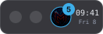
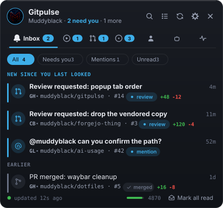
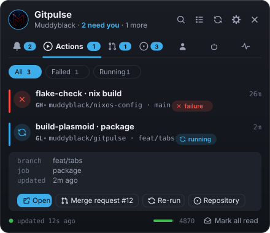
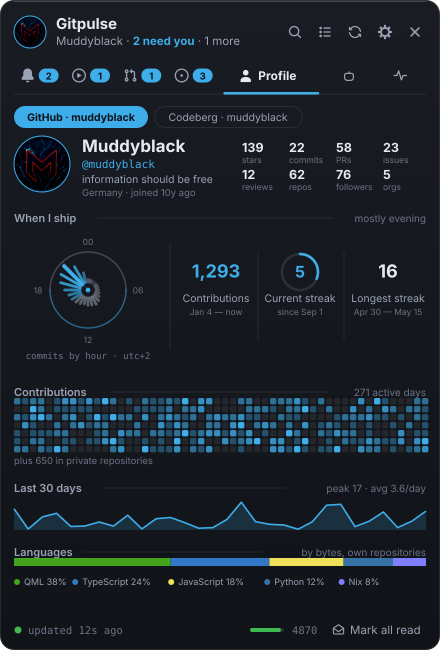
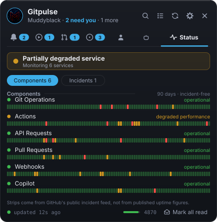

<p align="center">
  
</p>

<h1 align="center">Gitpulse</h1>

<p align="center">
  <a href="https://www.opendesktop.org/p/2368081/">
    
  </a>
  
  <a href="LICENSE">
    
  </a>
  <a href="https://www.opendesktop.org/p/2368081/">
    
  </a>
  <a href="https://github.com/Muddyblack/kde-gitpulse/releases">
    
  </a>
</p>

<p align="center"><strong>The pulse of your repos, in your panel.</strong></p>

<p align="center">
  GitHub notifications, CI runs, pull requests, issues, your profile and GitHub service health —<br>
  as a native <strong>KDE Plasma 6</strong> widget or <strong>Hyprland / Quickshell</strong> panel.
</p>

<p align="center">
  
</p>

> Built for KDE Plasma 6 and Hyprland / Quickshell, with one shared GitHub core.

## At a glance

| Native to your desktop | Knows what needs you | Keeps the details nearby |
| --- | --- | --- |
| One shared core, with a Plasma plasmoid and Hyprland / Quickshell frontend. | The badge counts things blocking **you**, not every unread notification. | Inspect workflow runs, reviews, service health, profile activity, and more without opening a browser. |

## A closer look

| Inbox | Actions |
| --- | --- |
|  |  |
| Review requests, mentions, assignments and an honest unread workflow. | Recent workflow runs, with failures first. |

| Profile | GitHub status |
| --- | --- |
|  |  |
| Contribution activity, language mix and account stats. | Component health and 90-day incident-derived strips. |

## At home in your desktop

Gitpulse is available as a **KDE Plasma 6** plasmoid and a **Hyprland /
Quickshell** panel. It uses the desktop notification system, follows your
Plasma theme and accent colour, and uses your GitHub avatar as the tray icon
when signed in.

## Everything in the popup

| Tab | What it shows |
| --- | --- |
| **Inbox** | Unread notifications, with a "new since you last looked" divider |
| **Actions** | Workflow runs across your recently-pushed repos, failures first |
| **Pulls** | Pull requests awaiting your review, and your own |
| **Issues** | Issues you are involved in, assignment highlighted |
| **Profile** | Stats, a contribution heatmap in your accent colour, language mix |
| **Copilot** | Copilot service health and billed usage |
| **Status** | GitHub service health with a 90-day incident strip per component |

### The badge means one thing

The tray count is **"someone is blocked on you"**, not "unread". It counts
unread review requests, mentions, team mentions, assignments and security
alerts, plus failing runs on your branches and PRs awaiting your review. An
open issue on your plate is tracked but never inflates it.

Cross-tab de-duplication means a `review_requested` notification and the pull
request behind it count **once** — the inbox wins, because that is where the
action lives.

---

## Install

### NixOS (flake)

```nix
{
  inputs.gitpulse.url = "github:Muddyblack/kde-gitpulse";

  # KDE: the plasmoid
  environment.systemPackages = [ inputs.gitpulse.packages.${system}.default ];

  # Hyprland: tray + shell
  # nix run github:Muddyblack/kde-gitpulse#hyprland
}
```

### Any distribution, from source

```sh
git clone https://github.com/Muddyblack/kde-gitpulse
cd gitpulse
make install          # copies into ~/.local/share/plasma/plasmoids and restarts plasmashell
```

`NO_RESTART=1 make install` skips the `plasmashell` restart.

### As a `.plasmoid` archive

```sh
make pack             # writes gitpulse-<version>.plasmoid
kpackagetool6 --type Plasma/Applet --install gitpulse-0.1.0.plasmoid
```

Then add it from **Add Widgets…**, or drop it into the System Tray — the
package declares `X-Plasma-NotificationArea`, so it is offered there.

---

## Token

Gitpulse only ever reads. Create a token at
**github.com ▸ Settings ▸ Developer settings ▸ Personal access tokens**, then
paste it into the widget's **Account** settings page and press **Check** — it
tells you immediately whether GitHub accepted it and who it signed you in as.

A **classic** token wants:

| Scope | For |
| --- | --- |
| `notifications` | the Inbox tab |
| `repo` | private repositories, and Actions runs in them |
| `read:org` | organisation repositories |
| `read:user` | the Profile tab's contribution graph |

Fine-grained tokens work for everything except the contribution heatmap:
GitHub's GraphQL `contributionsCollection` is not available to them. The
Profile tab degrades to stats-without-heatmap and says so rather than failing.

The token is stored in the widget's own config file under
`$XDG_CONFIG_HOME`, which is not world-readable. On the Hyprland side it lives
in `$XDG_CONFIG_HOME/gitpulse/hyprland-settings.json`, written atomically and
listed in `.gitignore`.

### Rate limit

Defaults poll the inbox every 60 s, searches every 180 s and Actions every
300 s — roughly 170 of GitHub's 5000 requests per hour, worst case. Every GET
carries its previous `ETag`, and GitHub does not count a `304` against the
limit, so the real figure is usually far lower. The Sources settings page shows
the estimate live as you change the intervals, and the popup footer shows what
is actually left.

---

## Hyprland

```sh
nix run github:Muddyblack/kde-gitpulse#hyprland
```

Or manually, from a checkout:

```sh
cmake -S hyprland/tray -B build && cmake --build build
./build/gitpulse-tray "$(command -v qs)" "$PWD/shell.qml" \
  "$PWD/package/contents/icons/org.muddyblack.gitpulse.svg" &
qs -p "$PWD/shell.qml"
```

Point `qs` at **`shell.qml` in the repository root**, never at the file in
`hyprland/`. Quickshell roots its QML sandbox at the entry point's directory,
and the Hyprland frontend imports the same `Engine.qml` and JS the Plasma
widget uses from `package/contents/` — rooted at `hyprland/`, those imports
escape the sandbox and nothing loads.

The popup starts hidden. Click the tray icon, or drive it directly:

```sh
qs ipc -p "$PWD/shell.qml" call panel toggle
```

`show`, `hide`, `refresh`, `badge`, `summary` and `quit` are also available —
the tray helper uses `badge` and `summary` to paint itself rather than keeping
a second copy of your token.

All seven tabs are present on this side too. Only Copilot is off by default,
since most accounts have nothing to report there.

---

## Keyboard

Everything below works whenever the popup is open; press <kbd>?</kbd> for the
same list in the widget.

| Key | Action |
| --- | --- |
| <kbd>↑</kbd> <kbd>↓</kbd> | move through the list |
| <kbd>Enter</kbd> | open, mark read, close |
| <kbd>Ctrl</kbd>+<kbd>Enter</kbd> | open in the background |
| <kbd>Space</kbd> | expand inline actions |
| <kbd>M</kbd> | mark read |
| <kbd>Shift</kbd>+<kbd>M</kbd> | mark all read (undoable) |
| <kbd>/</kbd> | filter |
| <kbd>Alt</kbd>+<kbd>1…9</kbd> | jump to a tab |
| <kbd>G</kbd> | group by repository |
| <kbd>R</kbd> | refresh now |
| <kbd>Esc</kbd> | clear filter, then close |

Mouse: left-click a row opens it, middle-click dismisses it without opening,
and the chevron expands the actions. On the tray icon, middle-click refreshes
and the scroll wheel cycles tabs. A global shortcut can be assigned in the
widget's own **Keyboard Shortcuts** config page.

### Undo

"Mark all read" waits six seconds behind an undo toast before it contacts
GitHub. That is not decoration: the REST API has no *mark unread*, so the only
honest undo is one where the request has not been sent yet. The window is
configurable, and zero sends immediately.

---

## What this cannot do

Stated plainly, because the alternative is inventing numbers:

- **Per-user Copilot statistics do not exist in the public API.** Completion
  counts and acceptance rates are organisation- and enterprise-admin endpoints.
  The Copilot tab therefore shows service health (which needs no token at all),
  billed usage when your token can read the billing endpoint, and organisation
  metrics if you configure an org you administer.
- **The 90-day strips are incident-derived.** githubstatus.com publishes
  current component status and an incident feed, but not the per-component
  uptime series behind the bars on its own site. Gitpulse builds its strips
  from the incident feed and labels them "incident-free days" — not an uptime
  percentage, because it is not one.
- **Contribution heatmaps need a classic token** (see above).

---

## Development

```sh
nix develop          # qmllint, qmlformat, qml, plasma-sdk, pre-commit
make help            # list targets
make test            # shared-core unit tests + engine smoke test
make lint            # qmllint every QML file
make format          # qmlformat in place
make view            # preview the widget standalone
make install         # install into the running Plasma session
```

### Layout

```
package/contents/
  code/       GitHub.js · Contract.js · Format.js   — the whole GitHub layer
  ui/         Engine.qml + the Plasma UI
  config/     main.xml (kcfg) + the config dialog pages
hyprland/     Quickshell frontend, reusing code/ and Engine.qml unchanged
  tray/       Qt Widgets StatusNotifier binary that drives it over qs ipc
tests/        run-tests.qml (pure logic) · engine-smoke.qml (runtime)
```

`GitHub.js` is transport and error classification, `Contract.js` normalises
five different payload shapes into one item and owns the badge arithmetic, and
`Format.js` is presentation helpers. All three are `.pragma library` scripts
with no QML dependencies, which is why `tests/run-tests.qml` can exercise them
directly — 112 assertions against the exact code that ships, in the exact
engine it ships on.

## Licence

MIT — see [LICENSE](LICENSE).
